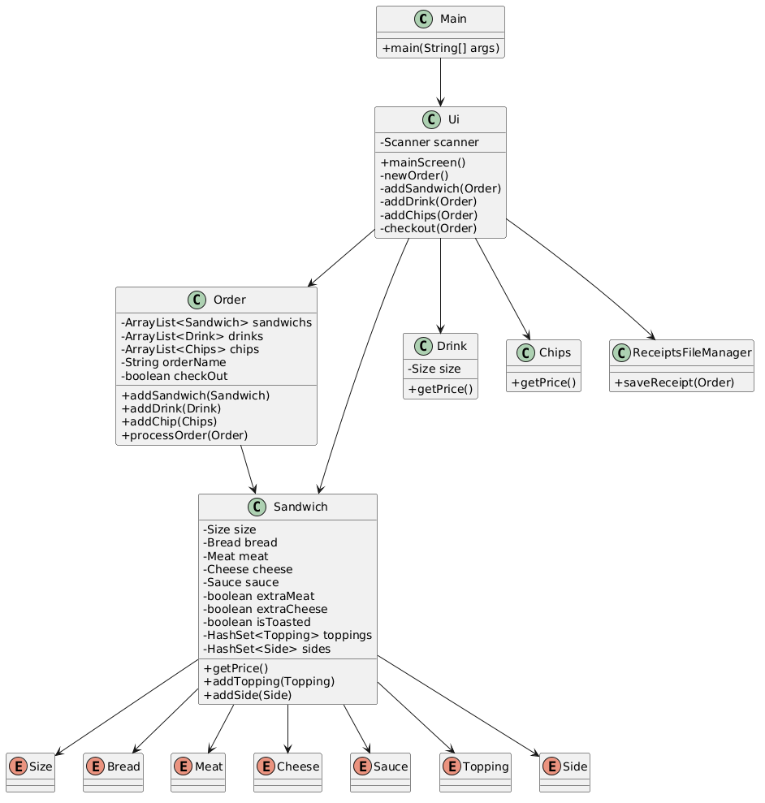

# 🥪 Deli-cious Sandwich Shop

A Java console-based sandwich ordering system that allows users to build custom sandwiches, add drinks, chips, and signature sandwiches, and generate a receipt saved as a file. 🧾

---
## 🧩 UML Diagram


---

## 🚀 Features

- 🥪 Build custom sandwiches step by step
- 🍞 Choose bread type and size
- 🥩 Select meats (with optional extra meat)
- 🧀 Choose cheese (with optional extra cheese)
- 🥗 Add multiple toppings (with duplicate prevention)
- 🧂 Select sauces
- 🍟 Add sides (Au Jus, Sauce)
- 🥤 Add drinks (Small, Medium, Large)
- 🍟 Add chips
- ⭐ Pre-built signature sandwiches (BLT, Philly, etc.)
- 🧾 Automatic receipt generation
- 💾 Save receipt to `.txt` file with timestamp

---

## 🧱 Project Structure

- `Main` → Starts the application
- `Ui` → Handles all user interaction and menus
- `Order` → Stores and processes all order items
- `Sandwich` → Builds and calculates sandwich price
- `Drink` → Represents drink items
- `Chips` → Represents chips item
- `ReceiptsFileManager` → Saves receipt to file
- `Enums` → Contains:
    - Bread 🍞
    - Size 📏
    - Meat 🥩
    - Cheese 🧀
    - Sauce 🧂
    - Topping 🥗
    - Side 🍽️

---

## ▶️ How to Run

1. Compile the project:
   ```bash
   javac Main.java

2. Run the program:

   ```bash
   java Main
   ```

---

## 🧾 How Ordering Works

1. Start the app
2. Enter your name
3. Choose:

    * Sandwich 🥪
    * Drinks 🥤
    * Chips 🍟
    * Signature Sandwich ⭐
4. Customize your sandwich step-by-step
5. Proceed to checkout 🧾
6. Confirm order
7. Receipt is saved automatically 💾

---

## 💰 Pricing Logic

### 🥪 Sandwich Base Price

* Small: $5.50
* Medium: $7.00
* Large: $8.50

### ➕ Add-ons

* Meat varies by size
* Extra meat: additional charge
* Cheese varies by size
* Extra cheese: additional charge
* Drinks and chips added separately

---

## 📁 Receipt Output

* Stored in:

  ```
  Receipts/yyyyMMdd-HHmmss.txt
  ```
* Includes:

    * Order name
    * All items
    * Itemized pricing
    * Total cost

---


## ⚙️ Key Logic Highlights

* 🚫 Prevents duplicate toppings and sides
* 🔁 Menu loops until valid input is provided
* 🧠 Signature sandwiches are pre-configured
* 🧾 Receipt generation uses `StringBuilder`
* 💾 File writing uses `BufferedWriter`

---

## 🛠️ Technologies Used

* Java ☕
* OOP (Object-Oriented Programming)
* Enums
* File I/O
* Console UI

---

## ⭐ Favorite Code Snippet

One of my favorite parts of the project is the validation logic that prevents users from selecting meat multiple times for the same sandwich.

```bash
private void addMeat(Sandwich sandwich) {

        if (sandwich.getMeat() != null && !sandwich.getMeat().equals(Meat.NO_MEAT)) {

            System.err.println("You have already selected meat: " + sandwich.getMeat());

            return;
        }
```
---

## 📌 Notes

* Input validation is handled via loops
* Extra meat and cheese are optional toggles
* System uses terminal-based interaction only

---

## 🎉 Enjoy your sandwich experience!

